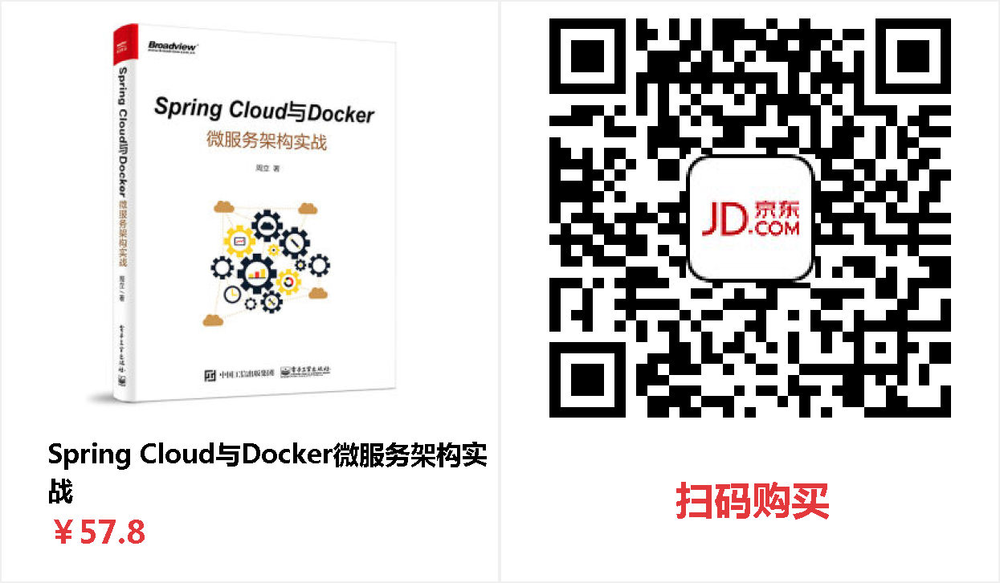

## README

## 一、背景

假设有一个遗留的Dubbo系统，现在想改用Spring Cloud。

由于遗留Dubbo系统比较庞大，短期之内无法完成技术栈的迁移。因此需要“分步走”，即：初期实现两者共存，后期逐步绞杀Dubbo应用，最终实现技术栈的统一。

p.s. 这里并没有贬低Dubbo的意思，仅是按照该场景讨论。

## 二、头脑风暴

架构迁移、技术栈更换、项目重构时的第一步往往不是“改造”，而是“停止修改”。基于这个原则，个人不太倾向于去立即大幅重构Dubbo应用原先的代码。原因有二：首先是原则问题，更重要的是时间成本、技术风险很难得到控制。

而，假如新编写的Spring Cloud应用去进行迁就，例如：

* 完全不动Dubbo遗留系统，使用RestTemplate或Feign编写Dubbo（DubboX）的RESTful API客户端代理 —> 有一定的实现复杂度、Dubbo接口改造成RESTful API后，消费方都需要再次修改（开始是代理，后来不用代理，因此有二次修改的问题）。
* 索性将Spring Cloud应用也整合Dubbo—>存在改造不完整、技术栈不统一、无法约束开发人员用哪种方式API、额外的复杂度的问题（越多的组件、越多的环节意味着越多的坑）。

考虑到一般来讲，遗留系统的改造过程中一般都是新系统调用老系统，很少出现老系统大规模调用新系统的场景（至少我这边目前是这样^_^）。因此，笔者列出几种仅需少量的代码编写成本即可实现Spring Cloud与Dubbo短期/长期共存，并且侵入性较小，同时还允许我们改造遗留Dubbo系统的几种方案，算是**抛砖引玉。期待朋友们提出更优雅、成本更小的方案。**

## 三、亮代码

### Sample1：借助Ribbon调用Dubbo应用。

优点：架构不依赖Eureka或其他服务注册组件，借助Ribbon去调用Dubbo微服务暴露的RESTful API；

缺点：如果Dubbo微服务较多时，均需手动配置，不适合新式的部署环境（例如Docker，因为每次部署IP/端口可能都不同）

###  Sample2：借助Sidecar

使用Sidecar，Dubbo微服务必须实现健康检查（对于Spring Boot程序即：添加spring-boot-starter-actuator依赖）。

优点：

* 这种方式下，Dubbo应用也可通过Sidecar调用Spring Cloud微服务的接口，Sidecar是连接Spring Cloud应用于Dubbo应用的桥梁。
* 可以通过Sidecar传播Dubbo微服务的健康状态到Eureka Server。

缺点：

* 在于每个Dubbo微服务节点必须额外部署一个Sidecar应用。
* 在Dubbo微服务调用Spring Cloud微服务时，增加了调用链的长度。（需使用Sidecar转发）

### Sample3：借助Eureka实现整合

将Dubbo应用也注册到Eureka上。

优点：

* 没有多余的组件（除了Dubbo的注册中心ZK）
* 没有什么局限

缺点：

* 对于非Spring Boot的应用，改造有一定的成本。

## GOING FAR

本项目中几个Demo中，都是手动编码为Dubbo应用开放RESTful API的，实际迁移过程可以借助cglib或者lombok之类的工具，实现从Dubbo接口道RESTful API的转换。本仓库主要还是为大家提供思路，不做具体讨论。

## 四、广告

* Spring Cloud QQ交流群：**564840207**、157525002（已满）

* 实体书《Spring Cloud与Docker微服务架构实战》上线啦！

  * **京东购书链接**

  

* 实体书配套代码：<http://www.itmuch.com/advertisment/my-spring-book-code/>

* 个人博客：<http://www.itmuch.com>

* 个人公众号：

  
